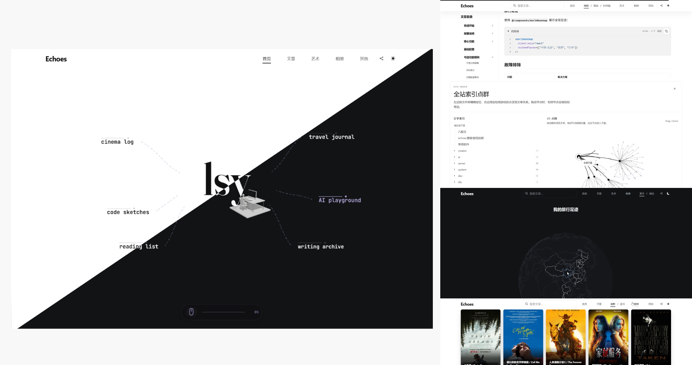

<p align="center">
  
</p>

# New Echoes

New Echoes 是一个 Astro 个人站点模板，适合搭建文章、项目、书影音、相册和旅行足迹一体化的个人主页。

它提供滚动动画首页、文章浏览、项目展示、书影音记录、照片墙、旅行地图和多平台部署配置。

## 在线预览

- Cloudflare Pages: <https://newechoes.pages.dev/>
- Vercel: <https://newechoes.vercel.app/>
- EdgeOne Pages（非大陆ip）: <https://newechoes.edgeone.app/>

## 功能效果

| 功能 | 页面效果 |
| --- | --- |
| 3D 首页 | 首屏展示滚动叙事动画；继续滚动后进入桌面、键盘和人物模型组成的 3D 场景 |
| 文章目录 | 按目录浏览文章，适合把内容分成开发、生活、读书等主题 |
| 文章筛选 | 按关键词、标签、时间范围筛选文章 |
| 时间线 | 按发布时间和更新时间查看文章变化 |
| 文章详情 | 支持代码高亮、复制按钮、表格、任务列表、Mermaid 图表和修订历史 |
| 项目页 | 展示 GitHub / Gitee / Gitea 项目列表，包括简介、语言、星标等信息 |
| 电影页 | 展示豆瓣观影记录 |
| 书单页 | 展示微信读书书单 |
| 相册页 | 用 Google Photos 分享相册生成瀑布流照片墙 |
| 关于页 | 展示倒计时和可交互的 3D 世界旅行足迹 |
| 全局图谱 | 以图谱方式查看文章之间的关系 |
| 订阅与索引 | 生成 RSS、sitemap、robots 和 `llms.txt` |

<p align="center">
  
</p>


## 适合谁

- 想要一个包含多种内容页面的个人站点。
- 想同时展示文章、项目、读书、观影、照片和旅行记录。
- 想保留一个可长期同步更新的公共模板仓库。
- 想部署到 Vercel、Cloudflare Pages 或 EdgeOne Pages。

## 快速开始

建议准备：

- Node.js 22+
- Bun
- pnpm

```bash
git clone https://github.com/lsy2246/newechoes.git
cd newechoes
bun install
bun run dev
```

开发服务默认运行在 <http://localhost:4321>。

## 基础配置

主要站点信息在 `src/consts.ts`：

```ts
export const SITE_META = {
  url: "https://example.com",
  title: "Echoes",
  author: "Site Owner",
  description: "A personal writing, projects, and knowledge site.",
} as const;
```

完整配置示例见 `src/consts.example.ts`。

## 写文章

创建文章：

```bash
bun run newpost
```

也可以直接指定目录和标题：

```bash
bun run newpost "dev/文章标题"
```

文章示例：

```md
---
title: "文章标题"
date: 2026-05-29
tags: ["标签1", "标签2"]
summary: "可选摘要"
---

文章内容...
```

`title` 会用于生成文章 URL，同一个文件夹里不要重复。

更详细的写作、页面和数据接入说明见 [echoes 博客使用说明](./src/content/echoes博客使用说明.md)。

## 常用命令

| Command | Description |
| --- | --- |
| `bun run dev` | 启动本地开发服务 |
| `bun run build` | 构建站点 |
| `bun run build:vercel` | 构建 Vercel 版本 |
| `bun run build:cloudflare` | 构建 Cloudflare Pages 版本 |
| `bun run build:edgeone` | 构建 EdgeOne Pages 版本 |
| `bun run deploy:cloudflare` | 部署到 Cloudflare Pages |
| `bun run newpost` | 创建新文章 |
| `bun run test` | 运行测试 |

## 部署

| Platform | Build command | Output | Function entry |
| --- | --- | --- | --- |
| Vercel | `bun run build:vercel` | `dist` | `api/` |
| Cloudflare Pages | `bun run build:cloudflare` | `dist` | `functions/api/` |
| EdgeOne Pages | `bun run build:edgeone` | `dist` | `cloud-functions/api/` |

Vercel 和 EdgeOne 的配置文件分别是 `vercel.json`、`edgeone.json`。Cloudflare Pages 可以用控制台连接仓库，也可以运行 `bun run deploy:cloudflare`。

## 项目结构

```text
.
├── api/                    # Vercel 函数入口
├── docs/                   # 设计记录和实施计划
├── public/                 # 静态资源、字体、地图、3D 模型
├── scripts/                # 构建脚本
├── src/
│   ├── components/         # 页面组件
│   ├── content/            # Markdown / MDX 文章
│   ├── lib/                # 工具逻辑
│   ├── pages/              # 页面路由
│   ├── platform/           # 多平台适配
│   ├── plugins/            # Astro / rehype 插件
│   └── server/             # API 处理器
├── test/                   # 测试
└── wasm/                   # Rust / WebAssembly 模块
```
