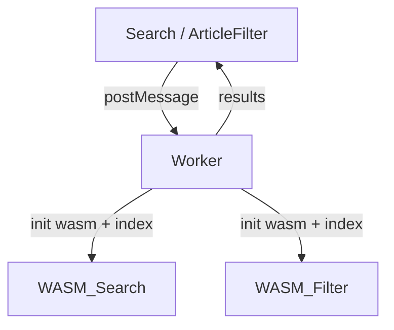

# 变更提案: perf-wasm-refactor

## 元信息

```yaml
类型: 优化
方案类型: implementation
优先级: P1
状态: 部分完成（验证待确认）
创建: 2026-02-07
```

---

## 1. 需求

### 背景

- 搜索/筛选 WASM 在主线程执行，输入时同时触发建议与搜索，产生卡顿。
- 搜索索引每次查询重复解压，CPU 与 GC 压力大。
- WorldHeatmap hover 交互频繁创建对象并重置全部线条颜色。

### 目标

- 将搜索与筛选 WASM 计算迁移至 Web Worker，并缓存索引。
- 主线程仅负责渲染与交互，降低输入/鼠标移动时的阻塞。
- Heatmap 交互只更新必要的高亮对象，减少每帧工作量。
- 通过 allocator 与 wasm-opt 降低 wasm 体积。

### 约束条件

```yaml
时间约束: 无
性能约束: 输入与 hover 交互不产生明显卡顿（主线程 <16ms/帧 目标）
兼容性约束: 现有 UI/路由/URL 参数逻辑不变
业务约束: 搜索与筛选结果与当前版本一致
```

### 验收标准

- [ ] Search/ArticleFilter 通过 Worker 调用 WASM，索引仅初始化一次，后续查询不再重复解压。
- [ ] 搜索与自动补全结果与现有行为一致，错误处理可回退提示。
- [ ] Heatmap hover 仅更新必要线条，高亮切换无明显抖动。
- [ ] 构建/运行无新增错误（astro dev/build）。

---

## 2. 方案

### 技术方案

- 新增 `wasm-worker`（模块化 Worker），统一加载 `search_wasm` 与 `article_filter`。
- Worker 内缓存索引：`initSearchIndex`/`initFilterIndex`；主线程仅发起 `search`/`suggest`/`filter` 请求。
- Search WASM 提供 `init_search_index` + `search_cached`，使用全局缓存；时间统计改为 `Date::now()` 以兼容 Worker。
- WorldHeatmap 复用 `Raycaster` 与球体 Mesh；高亮逻辑只更新变更线条集合。

### 影响范围

```yaml
涉及模块:
  - wasm: search wasm API 改造、worker 加载
  - components: Search、ArticleFilter、WorldHeatmap
  - assets: wasm 资源加载路径（保持不变）
预计变更文件: 8-12
```

### 风险评估

| 风险                      | 等级 | 应对                                                         |
| ------------------------- | ---- | ------------------------------------------------------------ |
| Worker 打包/路径解析问题  | 中   | 使用 Vite module worker 模式与相对路径导入，添加启动错误提示 |
| 搜索结果结构/排序不一致   | 中   | 对比旧行为，保持请求参数与返回结构一致                       |
| 交互回归（导航/面板关闭） | 低   | 保留现有 UI 状态管理，仅替换调用层                           |

---

## 3. 技术设计（可选）

### 架构设计



### API设计

#### Worker 消息协议

- **initSearch**: `{ type: "initSearch", indexUrl }`
- **initFilter**: `{ type: "initFilter", indexUrl }`
- **search**: `{ type: "search", request }`
- **suggest**: `{ type: "suggest", request }`
- **filter**: `{ type: "filter", request }`
- **getTags**: `{ type: "getTags" }`

### 数据模型

- `SearchResult`, `FilterResult` 沿用现有结构（不变）

---

## 4. 核心场景

### 场景: 搜索输入

**模块**: components/Search
**条件**: 用户输入关键词
**行为**: UI → Worker（suggest/search）→ 回填结果
**结果**: 主线程不卡顿，结果与现有一致

### 场景: 文章筛选

**模块**: components/ArticleFilter
**条件**: 用户调整筛选条件
**行为**: UI → Worker（filter）→ 回填列表
**结果**: 筛选速度提升，分页/URL 行为不变

### 场景: 地图 hover

**模块**: components/WorldHeatmap
**条件**: 鼠标移动
**行为**: 复用对象，最小更新高亮
**结果**: 交互顺滑，CPU 降低

---

## 5. 技术决策

### perf-wasm-refactor#D001: 搜索/筛选迁移至模块化 Worker

**日期**: 2026-02-07
**状态**: ✅采纳
**背景**: 主线程卡顿明显，WASM 计算负载高
**选项分析**:
| 选项 | 优点 | 缺点 |
|------|------|------|
| A: Worker 化（搜索+筛选） | 主线程压力显著降低，可复用缓存 | 引入消息协议与初始化复杂度 |
| B: 仅 WASM 内缓存 | 改动小 | 主线程仍阻塞 |
**决策**: 选择方案A
**理由**: 性能收益更大，符合“性能优先”
**影响**: wasm/search、components/Search、components/ArticleFilter

### perf-wasm-refactor#D002: release 构建启用 wee_alloc + wasm-opt 压缩
**日期**: 2026-02-07
**状态**: ✅采纳
**背景**: wasm 体积仍有可压缩空间
**选项分析**:
| 选项 | 优点 | 缺点 |
|------|------|------|
| A: wee_alloc + wasm-opt -Oz | 体积更小，改动可控 | 需要构建时额外步骤 |
| B: 仅保留当前 profile | 无额外步骤 | 体积优化有限 |
**决策**: 选择方案A
**理由**: 对包体积收益更直接，适合发布优化
**影响**: wasm/search、wasm/geo、wasm/article-filter、assets/wasm
