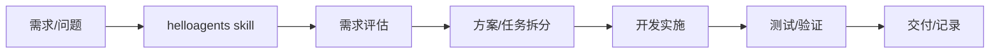
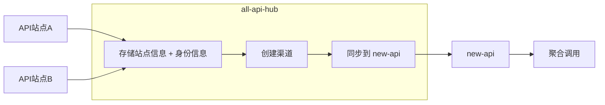

## vibe-coding 使用流程

### 1. 装好 VSCode 插件

- 在 VSCode 扩展里安装 Codex、Claude Code 等 AI 插件
- 目标是：能随时拉起对话、生成/解释代码

### 2. 一键配置开发环境

- [cc-switch](https://github.com/farion1231/cc-switch)：一键配置 codex、claude code、gemini 等 AI 配置文件和 skills

### 3. 使用技能(Skills)提升效率

**什么是技能(Skills)?**

- Skills 是 AI 工具的能力扩展包,可以让 AI 按特定流程或方法完成任务
- 类似给 AI 安装"专业插件",让它掌握某个领域的最佳实践

**推荐工具:**

- [helloagents](https://github.com/nightwhite/helloagents):流程化协作 skill,把开发需求按"评估 → 拆分 → 实施 → 验证"的标准流程走完
- [skills.sh](https://skills.sh/):技能市场,需要新能力时先搜索对应 skill,安装后即可使用
- [find-skills](https://skills.sh/vercel-labs/skills/find-skills):帮助你在 skills.sh 上快速找到合适的技能

### helloagents 协作流程图

## API 站点管理（all-api-hub → new-api）

### 目标

把各种 API 站点的信息统一记录，并把可用渠道同步到聚合层。

### 工具

- [all-api-hub](https://github.com/qixing-jk/all-api-hub)：维护站点信息 + 身份信息，并产出可同步的渠道
- [new-api](https://github.com/QuantumNous/new-api)：接收渠道并做多站点聚合调用

### 流程图

