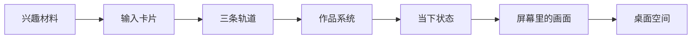

叙事动画网页先设计对象的连续状态。

一段动画里真正被用户记住的，通常是持续出现的对象。人眼会追踪相似形状、连续轨迹和共同运动方向。场景衔接顺滑，靠的就是这些认知线索。

我的首页可以拆成一条对象链。

这条链的重点是同一批信息被反复改写。电影、旅行、代码、AI、阅读、写作先作为材料出现，随后被整理成输入卡片，再进入 seeing、making、thinking 三条轨道。making 继续展开成作品，作品再压缩进 today 里的 BUILD。前面的画面进入电脑屏幕后，镜头拉开到桌面空间。

## 先写状态表

做叙事动画前，可以先写对象状态表。

| 对象 | 前一段状态 | 后一段状态 | 连续线索 |
| --- | --- | --- | --- |
| 兴趣材料 | 散点 | 输入卡片 | 位置收拢 |
| 输入卡片 | 六个素材 | 三条轨道 | 分组移动 |
| making 轨道 | 分类之一 | 作品列表 | 局部放大 |
| 作品卡片 | 展开的项目 | BUILD 索引 | 折叠压缩 |
| 故事画面 | 全屏信息 | 屏幕内容 | 画面嵌入 |

这张表比单独写分镜更重要。分镜只描述每一幕长什么样，状态表描述每个对象怎样从上一幕走到下一幕。

## 场景靠锚点交接

每一段衔接都需要锚点。锚点是用户注意力停留的位置。

材料收拢时，中心区域是锚点。分类出现时，三条轨道是锚点。作品展开时，making 轨道是锚点。进入空间时，电脑屏幕是锚点。

锚点决定运动方向。元素朝锚点聚集，锚点稳定后，下一段内容接管画面。这样用户能看到来源，也能看到去向。

## 动作承担语义

叙事动画里的动作要表达关系。

收拢表示整理。分组表示分类。放大表示聚焦。折叠表示沉淀。镜头后退表示从信息内部来到信息所在的环境。

动作和语义对上，页面就会自己解释自己。用户看到卡片进入轨道，会理解材料被分类。看到作品压缩成 BUILD，会理解作品变成当前状态的一部分。

## 保留短暂重叠

顺滑的衔接通常有一段重叠时间。

旧对象还在移动时，新结构已经出现。新结构开始清晰时，旧对象保留部分形状。用户同时看到起点和终点，理解成本会低很多。

我的首页里，材料先进入输入卡片，再进入分类轨道。作品先压缩，再被 today 面板接住。2D 画面先进入屏幕，镜头再拉开到桌面。每一步都让前后状态共存一小段时间。

## 技术只服务这条链

滚动进度负责控制故事时间。Canvas 负责稳定绘制大量可变对象。Three.js 负责空间和镜头。技术分层可以不同，叙事链要统一。

检查这类页面时，只看三个问题。

当前对象从哪里来。  
它要变成什么。  
用户能否看见这段变化。

答案成立，叙事动画就会有连续感。
