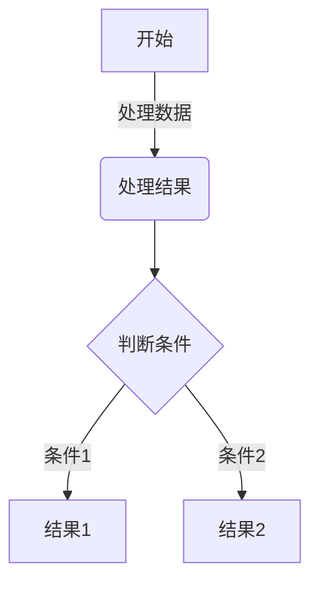

基于 Astro + React + WASM 构建的个人博客系统，提供文章管理、项目展示、观影记录等功能。

## 功能特点

1. **响应式设计**：适配桌面端和移动端
2. **深色模式**：支持自动和手动切换主题
3. **文章系统**：支持 Markdown 写作
4. **项目展示**：展示 GitHub、Gitea 和 Gitee 项目
5. **观影记录**：集成豆瓣观影数据
6. **读书记录**：集成豆瓣读书数据
7. **RSS 支持**：自动生成 RSS 订阅源
8. **旅行足迹**：展示全球旅行足迹热力图
9. **页面过渡**：页面间无缝过渡动画
10. **高效搜索**：全文搜索与智能推荐
11. **优化代码块**：支持 Mermaid 图表和多主题代码高亮
12. **SEO 优化**：完整元数据支持
13. **资源压缩**：优化加载速度

## 基础配置

主要配置文件位于 `src/consts.ts`：

```typescript
// 网站基本信息
export const SITE_URL = "https://your-domain.com";
export const SITE_TITLE = "你的网站名称";
export const SITE_DESCRIPTION = "网站描述";

// 导航链接结构
export const NAV_STRUCTURE = [
    {
        id: 'home',
        text: '首页',
        href: '/'
    },
    {
        id: 'articles',
        text: '文章',
        items: [
            { id: 'filter', text: '筛选', href: '/filtered' },
            { id: 'path', text: '网格', href: '/articles' }
        ]
    },
    // 其他导航项...
];

// 备案信息
export const ICP = "你的ICP备案号";
export const PSB_ICP = "你的公安备案号";
export const PSB_ICP_URL = "备案链接";
```

## 文章写作

### 创建新文章

#### 1. 使用创建脚本（推荐）

```bash
# 添加执行权限（首次使用）
chmod +x create_post.sh

# 交互式创建
./create_post.sh

# 命令行参数创建
./create_post.sh "文章标题" "目录/文章路径"
```

脚本会自动创建文章文件、添加前置信息、检查文件存在性并显示路径。

#### 2. 手动创建

在 `src/content/articles` 目录下创建 `.md` 或 `.mdx` 文件：

```markdown
---
title: "文章标题"
date: YYYY-MM-DD
tags: ["标签1", "标签2"]
---

文章内容...
```

### 文章过期提醒

在 `src/consts.ts` 中配置：

```typescript
export const ARTICLE_EXPIRY_CONFIG = {
  enabled: true, // 是否启用
  expiryDays: 365, // 过期天数
  warningMessage: "这篇文章已发布超过一年，内容可能已过时", // 提醒消息
};
```

## RSS 功能

博客自动为文章生成 RSS 订阅源，访客可通过 `/rss.xml` 订阅更新。

### RSS 配置

在 `src/consts.ts` 中配置：

```typescript
export const RSS_CONFIG = {
  enabled: true, // 是否启用 RSS
  title: "博客标题", // RSS 标题
  description: "RSS 描述", // RSS 描述
  customData: `<language>zh-cn</language>`, // 自定义 RSS 数据
};
```

## 项目展示

展示 Git 平台的项目：

```astro
---
import GitProjectCollection from '@/components/GitProjectCollection';
import { GitPlatform } from '@/components/GitProjectCollection';
---

<GitProjectCollection
  platform={GitPlatform.GITEA}   // 平台类型：GITHUB、GITEA、GITEE
  username="your-username"       // 用户名
  title="Git 项目"               // 显示标题
  url="https://your-gitea.com"   // Gitea 实例 URL（Gitea 必填）
  token="your-token"             // 访问令牌（可选）
  perPage={10}                   // 每页显示数量
  client:load                    // Astro 指令
/>
```

## 观影和读书记录

展示豆瓣数据：

```astro
---
import DoubanCollection from '@/components/DoubanCollection.astro';
---

// 电影记录
<DoubanCollection
  type="movie"
  title="我看过的电影"
  doubanId="lsy22"
/>

// 读书记录
<DoubanCollection
  type="book"
  title="我读过的书"
  doubanId="lsy22"
/>
```

## 微信读书书单

```astro
---
import WereadBookList from '@/components/WereadBookList';
---

<WereadBookList 
  listId="12345678"    // 微信读书书单ID
  client:load
/>
```

从书单分享链接中获取ID：`https://weread.qq.com/misc/booklist/12345678`

## 旅行足迹

```astro
---
import WorldHeatmap from '@/components/WorldHeatmap';
// 配置你去过的地方
const VISITED_PLACES = [
  "中国-黑龙江",
  "中国-北京",
  "中国-上海",
  "马来西亚",
  "泰国",
  "美国",
];
---

<WorldHeatmap
  client:only="react"
  visitedPlaces={VISITED_PLACES}
/>
```

## 代码块与图表

支持 Mermaid 图表：

````markdown

````

## SEO 优化

- 自动生成元标签
- 支持结构化数据
- 自动生成站点地图
- 性能优化

## 资源优化

- 图片自动压缩
- CSS/JS 压缩
- 预加载关键资源
- 延迟加载非关键资源

## 主题切换

支持三种主题模式：跟随系统、浅色模式、深色模式。设置保存在 localStorage 中。

## 搜索功能

### 特点

- 高性能全文搜索
- 智能搜索推荐
- 拼写纠正
- 结构化搜索结果
- 高亮匹配文本

### 搜索操作

- **键盘导航**：上下箭头选择，Tab/右箭头接受建议，Enter 执行
- **结果浏览**：按相关性排序，滚动加载，黄色高亮匹配文本

## 快速开始

### 环境要求

- Node.js 18+
- npm 和 pnpm
- Rust (用于修改 WASM 组件)

### 安装步骤

1. 克隆项目

    ```bash
    git clone https://github.com/your-username/echoes.git
    cd echoes
    ```

2. 安装依赖

    ```bash
    pnpm i
    ```

3. 修改配置：编辑 `src/consts.ts`

4. 本地运行

    ```bash
    pnpm run dev
    ```

访问 `http://localhost:4321`

## 部署说明

### Vercel 一键部署

[](https://vercel.com/new/clone?repository-url=https://github.com/lsy2246/newechoes)

### 部署步骤

1. 点击上方的"Deploy with Vercel"按钮
2. 授权 Vercel 访问你的 GitHub 账号
3. 点击部署

或者手动部署：

1. Fork 项目到你的 GitHub
2. 在 Vercel 控制台导入项目
3. 点击部署

部署完成后，你可以将自定义域名绑定到 Vercel 项目。

## 常见问题

1. **图片问题**：检查路径，确保放入 `public` 目录
2. **豆瓣数据**：确认 ID 正确，记录公开
3. **Git 项目**：验证用户名，确认 API 访问
4. **WebAssembly**：确保浏览器支持，检查 CSP 限制
5. **RSS 问题**：检查配置，确认生成路径
