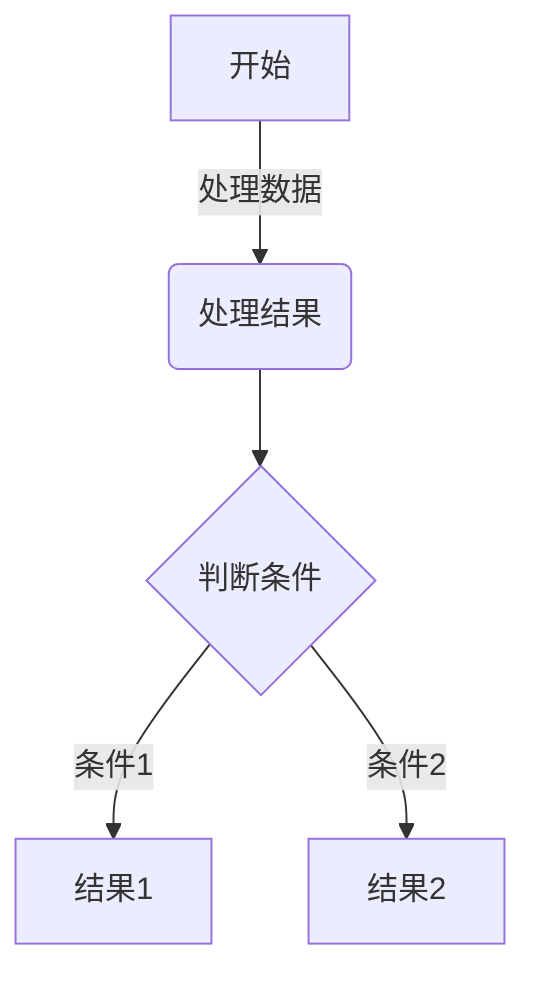

这是一个基于 Astro + React + WASM 构建的个人博客系统，具有文章管理、项目展示、观影记录、读书记录等功能。本文将详细介绍如何使用和配置这个博客系统。

## 功能特点

1. **响应式设计**：完美适配桌面端和移动端
2. **深色模式**：支持自动和手动切换深色/浅色主题
3. **文章系统**：支持 Markdown 写作，带有标签和分类
4. **项目展示**：支持展示 GitHub、Gitea 和 Gitee 的项目
5. **观影记录**：集成豆瓣观影数据
6. **读书记录**：集成豆瓣读书数据
7. **旅行足迹**：支持展示全球旅行足迹热力图，WebAssembly 解析地图数据，提高性能
8. **丝滑页面过渡**：使用 Swup 集成实现页面间无缝过渡动画，提供类似 SPA 的浏览体验，保留静态站点的所有优势
9. **高效搜索与筛选**：使用 Rust 构建二进制数据，WebAssembly 高效解析，提供快速精准的全文搜索体验
10. **优化代码块样式**：支持 Mermaid 图表解析，多主题代码高亮
11. **优化 SEO**：完整的元数据支持，内置性能优化
12. **资源压缩**：支持图片和静态资源压缩，提高加载速度

## 基础配置

主要配置文件位于 `src/consts.ts`，你需要修改以下内容：

```typescript
// 网站基本信息
export const SITE_URL = "https://your-domain.com";
export const SITE_TITLE = "你的网站名称";
export const SITE_DESCRIPTION = "网站描述";

// 导航链接结构 - 支持分层导航
export const NAV_STRUCTURE = [
    {
        id: 'home',
        text: '首页',
        href: '/'
    },
    {
        id: 'douban',
        text: '豆瓣',
        items: [
            { id: 'movies', text: '观影', href: '/movies' },
            { id: 'books', text: '读书', href: '/books' }
        ]
    },
    {
        id: 'articles',
        text: '文章',
        items: [
            { id: 'filter', text: '筛选', href: '/filtered' },
            { id: 'path', text: '文章', href: '/articles' }
        ]
    },
    {
        id: 'others',
        text: '其他',
        items: [
            { id: 'other', text: '其他', href: '/other' },
            { id: 'projects', text: '项目', href: '/projects' }
        ]
    }
];

// 备案信息
export const ICP = "你的ICP备案号";
export const PSB_ICP = "你的公安备案号";
export const PSB_ICP_URL = "备案链接";

```

## 文章写作

### 创建新文章

你可以通过以下两种方式创建新文章：

#### 1. 使用创建脚本（推荐）

项目根目录下提供了 `create_post.sh` 脚本来快速创建文章：

```bash
# 添加执行权限（首次使用时）
chmod +x create_post.sh

# 方式1：交互式创建
./create_post.sh
# 按提示输入文章标题和路径

# 方式2：命令行参数创建
./create_post.sh "文章标题" "目录/文章路径"
# 例如：./create_post.sh "我的新文章" "web/my-post"
```

脚本会自动：

- 在指定位置创建文章文件
- 添加必要的 frontmatter（标题、日期、标签）
- 检查文件是否已存在
- 显示文件的绝对路径

#### 2. 手动创建

在 `src/content/articles` 目录下创建 `.md` 或 `.mdx` 文件。文章需要包含以下前置信息：

```markdown
---
title: "文章标题"
date: YYYY-MM-DD
tags: ["标签1", "标签2"]
---

文章内容...
```

### 文章过期提醒

博客系统支持文章过期提醒功能，可以在 `src/consts.ts` 中配置：

```typescript
export const ARTICLE_EXPIRY_CONFIG = {
  enabled: true, // 是否启用文章过期提醒
  expiryDays: 365, // 文章过期天数
  warningMessage: "这篇文章已经发布超过一年了，内容可能已经过时，请谨慎参考。", // 提醒消息
};
```

## 项目展示

项目展示页面支持从 GitHub、Gitea 和 Gitee 获取和展示项目信息。

### GitProjectCollection 组件

用于展示 Git 平台的项目列表。

```astro
---
import GitProjectCollection from '@/components/GitProjectCollection';
import { GitPlatform } from '@/components/GitProjectCollection';
---

<GitProjectCollection
  platform={GitPlatform.GITEA}   // 平台类型：GITHUB、GITEA、GITEE
  username="your-username"       // 必填：用户名
  title="Git 项目"               // 可选：显示标题
  url="https://your-gitea.com"   // 可选：Gitea 实例 URL（Gitea 必填，GitHub/Gitee 无需填写）
  token="your-token"             // 可选：访问令牌，用于访问私有仓库
  perPage={10}                   // 可选：每页显示数量，默认 10
  client:load                    // Astro 指令：客户端加载
/>
```

## 观影和读书记录

用于展示豆瓣的观影和读书记录。

```astro
---
import DoubanCollection from '@/components/DoubanCollection.astro';
---

// 展示电影记录
<DoubanCollection
  type="movie"              // 类型：movie 或 book
  title="我看过的电影"      // 显示标题
  doubanId="lsy22"    // 豆瓣ID
/>

// 展示读书记录
<DoubanCollection
  type="book"
  title="我读过的书"
  doubanId="lsy22"
/>
```

## 微信读书书单组件

用于展示微信读书的书单内容，支持错误处理和优雅的加载状态。

```astro
---
import WereadBookList from '@/components/WereadBookList';
---

<WereadBookList 
  listId="12345678"    // 必填：微信读书书单ID，从书单URL中获取
  client:load          // Astro 指令：客户端加载
/>
```

### 获取微信读书书单ID

1. **打开微信读书**：在浏览器中访问微信读书网页版或使用微信读书小程序/App
2. **打开书单页面**：找到你想展示的书单并打开,点击分享，分享到浏览器
3. **获取书单ID**：从URL中提取书单ID，例如：`https://weread.qq.com/misc/booklist/12345678` 中的 `12345678` 即为书单ID

## 旅行足迹组件

用于展示你去过的地方，以热力图的形式在世界地图上显示。

```astro
---
import WorldHeatmap from '@/components/WorldHeatmap';
// 配置你去过的地方
const VISITED_PLACES = [
  // 国内地区格式：'中国-省份/城市'
  "中国-黑龙江",
  "中国-北京",
  "中国-上海",
  // 国外地区直接使用国家名
  "马来西亚",
  "泰国",
  "美国",
];
---

<WorldHeatmap
  client:only="react"
  visitedPlaces={VISITED_PLACES}
/>
```

## 代码块与 Mermaid 图表支持

博客系统现在支持丰富的代码块样式和 Mermaid 图表渲染：

### Mermaid 图表支持

````markdown

````


## SEO 优化

博客系统内置全面的SEO优化支持：

1. **自动生成元标签**：为每个页面生成适当的标题、描述和Open Graph标签
2. **结构化数据**：支持添加结构化数据，提高搜索引擎理解能力
3. **站点地图**：自动生成XML站点地图
4. **性能优化**：页面加载性能优化，提高搜索排名

## 资源压缩与优化

系统支持自动的资源压缩和优化：

1. **图片优化**：自动压缩和优化图片，支持WebP格式
2. **CSS/JS压缩**：自动压缩CSS和JavaScript文件
3. **预加载关键资源**：识别并预加载关键资源
4. **延迟加载非关键资源**：非关键资源延迟加载，提高初始加载速度

## 主题切换

系统支持三种主题模式：

1. 跟随系统
2. 手动切换浅色模式
3. 手动切换深色模式

主题设置会被保存在浏览器的 localStorage 中。

## 高效搜索与筛选

博客系统使用 Rust 构建二进制数据，结合 WebAssembly 高效解析，提供快速的全文搜索和筛选功能。

### 搜索功能特点

1. **高性能全文搜索**：使用 Rust 编写的搜索引擎，编译为 WebAssembly 在浏览器中运行
2. **智能搜索推荐**：输入时提供智能搜索建议和自动补全
3. **拼写纠正**：当用户输入可能存在错误时，提供拼写纠正建议
4. **结构化搜索结果**：按标题、内容层次展示匹配内容
5. **高亮显示匹配文本**：直观显示匹配位置
6. **Tab键补全**：支持使用Tab键快速补全搜索建议

### 搜索建议类型

1. **自动补全（Completion）**：当您输入部分词语时，系统会提供以此开头的完整词语或短语
   - 例如：输入"reac"时，可能会建议"react"、"reactjs"等

2. **拼写纠正（Correction）**：当您的输入可能有拼写错误时，系统会提供更可能的正确拼写
   - 例如：输入"javascritp"时，会提示"javascript"

### 搜索操作指南

1. **键盘导航**：
   - 使用上下箭头键在搜索建议之间切换
   - 使用Tab键或右箭头键接受当前建议
   - 使用Enter键执行搜索

2. **建议交互**：
   - 系统会实时显示最相关的建议
   - 建议会以淡色显示在您的输入文本后面
   - 补全建议使用灰色显示，拼写纠正建议使用琥珀色显示

3. **结果导航**：
   - 搜索结果会按相关性排序
   - 滚动到底部自动加载更多结果
   - 匹配文本会使用黄色高亮显示

## 快速开始

### 环境要求

- Node.js 18+
- npm 或 pnpm
- Rust (用于开发时修改WASM组件)

### 安装步骤

1. 克隆项目

    ```bash
    git clone https://github.com/your-username/echoes.git
    cd echoes
    ```

2. 安装依赖

    ```bash
    npm install
    ```

3. 修改配置

    编辑 `src/consts.ts` 文件，更新网站配置信息。

4. 本地运行

    ```bash
    npm run dev
    ```

访问 `http://localhost:4321` 查看效果。

## 部署说明

### 部署方式选择

1. **Vercel 部署（推荐）**

   - 支持所有功能
   - 自动部署和 HTTPS
   - 支持 API 路由和动态数据
   - 可配合多吉云 CDN 实现自动刷新缓存

2. **静态托管（如腾讯云）**
   - 仅支持静态文件
   - 不支持的功能：
     - API 路由（豆瓣数据、Git 项目等）
     - 动态数据获取
   - 需要手动配置和上传

### CDN 加速配置

博客支持通过多吉云 CDN 进行加速，并可通过 GitHub Actions 实现自动刷新缓存：

1. 按照[CDN 配置指南](./cdn配置)配置多吉云 CDN
2. 按照[GitHub Actions 自动刷新 CDN 缓存指南](./github-actions自动刷新多吉云_cdn缓存)配置自动刷新
3. 配置完成后，每次博客更新时，CDN 缓存将自动刷新

### 部署步骤

#### Vercel 部署

1. Fork 项目到 GitHub
2. 在 Vercel 导入项目
3. 配置环境变量（如果需要）
4. 点击部署

#### 静态托管部署

1. 修改 `astro.config.mjs`：

    ```javascript
    export default defineConfig({
      site: SITE_URL,
      output: "static",
      adapter: undefined,
    });
    ```

2. 构建并上传：

```bash
npm run build
# 上传 dist/client 目录到静态托管服务
```

## 常见问题

1. **图片无法显示**

   - 检查图片路径是否正确
   - 确保图片已放入 `public` 目录

2. **豆瓣数据无法获取**

   - 确认豆瓣 ID 配置正确
   - 检查豆瓣记录是否公开

3. **Git 项目无法显示**

   - 验证用户名配置
   - 确认 API 访问限制

4. **静态托管部署后功能异常**
   - 确认是否使用了需要服务器端支持的功能
   - 检查是否已将动态数据改为静态数据
   - 确认构建输出目录是否为 `dist/client`

5. **WebAssembly相关功能无法使用**
   - 确保浏览器支持WebAssembly
   - 检查是否启用了内容安全策略(CSP)限制
