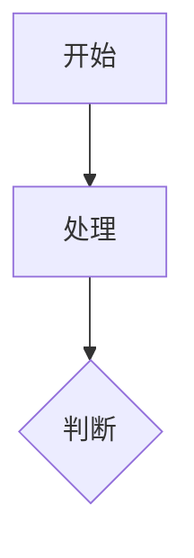

## 快速开始

### 环境要求

- Node.js 18+
- pnpm

### 三步启动

```bash
git clone https://github.com/lsy2246/newechoes.git
cd echoes && pnpm i
pnpm run dev  # 访问 http://localhost:4321
```

### 快捷部署

#### Vercel

[](https://vercel.com/new/clone?repository-url=https://github.com/lsy2246/newechoes)

- 构建命令：`pnpm run build:vercel`
- 输出目录：`dist`
- 后端目录：`api/`

#### Cloudflare Pages

1. 打开 Cloudflare Dashboard，进入 `Workers & Pages`
2. 选择 `Create application` -> `Pages` -> `Import an existing Git repository`
3. 连接 GitHub，并选择 `lsy2246/newechoes`
4. 构建命令填写：`pnpm run build:cloudflare`
5. 构建输出目录填写：`dist`
6. 保持仓库根目录下的 `functions/` 一起提交

如果你用本地 CLI 直传，命令是：

```bash
pnpm exec wrangler pages deploy dist
```

这个方式适合纯静态资源更新；如果项目依赖 `functions/`，优先用 Git 集成，或者确认在项目根目录执行 Wrangler，让 Pages Functions 一起被识别。

#### EdgeOne Pages

EdgeOne 目前更适合直接通过控制台导入 Git 仓库快速部署。

1. 打开 EdgeOne Pages，选择“导入 Git 仓库”
2. 连接 GitHub，并选择 `lsy2246/newechoes`
3. 构建命令填写：`pnpm run build:edgeone`
4. 根目录填写：`/`
5. 保持仓库根目录下的 `edgeone.json` 与 `cloud-functions/` 一起提交

部署完成后，静态页面会从 `dist/` 发布，后端函数会从 `cloud-functions/api/` 自动识别。

参考文档：

- [导入 Git 仓库](https://pages.edgeone.ai/zh/document/importing-a-git-repository)
- [直接上传](https://pages.edgeone.ai/zh/document/direct-upload)
- [Cloudflare Pages Git 集成](https://developers.cloudflare.com/pages/get-started/git-integration/)
- [Cloudflare Pages Direct Upload](https://developers.cloudflare.com/pages/get-started/direct-upload/)

## 部署说明

### 部署架构

当前项目统一采用这套结构：

- 前端：Astro 输出纯静态文件到 `dist/`
- 共享后端逻辑：`src/server/api/`
- Vercel 函数入口：`api/`
- Cloudflare Pages 函数入口：`functions/api/`
- EdgeOne Cloud Functions 入口：`cloud-functions/api/`

也就是说，三个平台现在都是同一套思路：

- 页面本身只输出静态文件
- 搜索索引、文章页、列表页都来自静态产物
- 豆瓣、微信读书、Git 项目、相册这些动态数据，通过各平台自己的函数目录接到同一份共享处理器上

这不是“某个平台单独走 SSR”，而是“统一静态前端 + 平台函数后端”。

### Vercel

- 构建命令：`pnpm run build:vercel`
- 输出目录：`dist`
- 函数目录：`api/`
- 配置文件：`vercel.json`

### Cloudflare Pages

- 构建命令：`pnpm run build:cloudflare`
- 输出目录：`dist`
- 函数目录：`functions/api/`
- CLI 部署命令：`pnpm exec wrangler pages deploy dist`

Cloudflare Pages 可以同时托管静态站点和 Pages Functions。  
如果项目里有 `functions/`，函数文件必须放在仓库根目录，不能放进 `dist/` 里。

### EdgeOne Pages

- 构建命令：`pnpm run build:edgeone`
- 输出目录：`dist`
- 函数目录：`cloud-functions/api/`
- 配置文件：`edgeone.json`

EdgeOne Pages 也是静态前端和平台函数并存的模式。  
它读取 `dist/` 里的静态站点，同时读取仓库根目录下的 `cloud-functions/` 和 `edgeone.json`。

### 路由备注

文章页现在统一输出为 `articles/*.html`，不是旧的目录式 `articles/*/index.html`。  
如果后面再改平台路由或重写规则，这个点要保持一致。

## 核心功能

### 文章系统

**创建文章（推荐方式）：**

```bash
pnpm new-post
```

运行后会进入交互模式：

- 动态扫描 `src/content` 下现有目录
- 先选择目标目录，默认使用当前目录
- 再输入文章标题

**也支持直接指定目录：**

```bash
pnpm new-post "server/文章标题"
```

> `create_post.sh` 已废弃，请使用 `pnpm new-post`。
> 也支持直接创建到根目录，例如 `pnpm new-post "文章标题"`，但建议优先放到下面的场景目录里。

**内容目录结构：**

```text
src/content/
  ai/
  creator/
  dev/
  life/
  misc/
  server/
  system/
```

**手动创建：** 在合适的内容目录下创建 `.md` 文件

```markdown
---
title: "文章标题"
date: 2026-05-29
tags: ["标签1", "标签2"]
---

文章内容...
```

`title` 是文章身份，也是文章 URL 的唯一来源。标题不能重复；移动文件、修改文件名或调整目录时，只要 `title` 不变，文章 URL 和历史归属就不会变化。

旧的文件路径详情页不会生成；文章正文里残留的旧链接只会被解析到新的标题地址，避免同时存在两套访问规则。

### Git 修订历史

文章的发布时间来自 frontmatter 的 `date`。文章的最后更新时间和修订记录来自 Git 历史，不需要手写 `updatedDate`。

- 文件移动或改名时会优先通过 `git log --follow` 追踪
- `title` 用来保证文章身份稳定，作为 Git rename 推断失败时的长期锚点
- 文章页会展示 commit-like 的修订记录
- 时间轴保留发布时间轴，并提供修订时间轴查看文章维护历史

如果希望修订记录里的提交和历史快照可以跳转到源码托管平台，在 `src/consts.ts` 中配置源码仓库地址：

```typescript
export const SOURCE_REPOSITORY_CONFIG = {
  url: "",
};
```

未配置 url 时，页面仍会读取本地 Git 历史，但不会生成提交或历史快照外链。GitHub、Gitee、GitLab、Bitbucket 等常见平台会根据 `url` 识别；自建 Gitea、Forgejo 或私有 GitLab 域名无法识别时，可以额外填写 `provider: "gitea"`、`provider: "forgejo"` 或 `provider: "gitlab"`。

### RSS 订阅

自动为所有文章生成 `/rss.xml` 订阅源，无需额外配置。

### Mermaid 图表

支持在文章中直接使用 Mermaid 图表：

````markdown

```mermaid
graph TD;
    A[开始] --> B[处理];
    B --> C{判断};
```
````

### 页面过渡与性能

- **View Transitions API** 与 **Swup** 实现流畅的无刷新切换
- **WebAssembly** 优化前端数据处理性能
- **SEO 优化**：自动生成元标签和站点地图
- **响应式设计**：自适应桌面和移动端

## 基础配置

编辑 `src/consts.ts` 配置网站信息：

```typescript
export const SITE_META = {
  url: "https://your-domain.com",
  title: "你的网站名称",
  author: "作者名",
} as const;

// 导航结构
export const NAV_STRUCTURE = [
  { id: "home", text: "首页", href: "/" },
  {
    id: "articles",
    text: "文章",
    items: [
      { id: "filter", text: "筛选", href: "/filtered" },
      { id: "path", text: "网格", href: "/articles" },
    ],
  },
  { id: "albums", text: "相册", href: "/albums" },
];
```

## 可选功能模块

### 文章过期提醒

在 `src/consts.ts` 中配置：

```typescript
export const ARTICLE_EXPIRY_CONFIG = {
  enabled: true,
  expiryDays: 365,
  warningMessage: "文章内容可能已过时",
};
```

### 项目展示

使用 `@/components/GitProjectCollection` 展示 Git 平台项目：

```astro
<GitProjectCollection
  platform={GitPlatform.GITHUB}
  username="your-username"
  title="我的项目"
  client:load
/>
```

### 豆瓣数据集成

使用 `@/components/DoubanCollection` 展示观影和读书记录：

```astro
// 观影记录
<DoubanCollection type="movie" title="看过的电影" doubanId="your-id" />
// 读书记录
<DoubanCollection type="book" title="读过的书" doubanId="your-id" />
```

### 相册瀑布流

相册页使用 Google Photos 分享链接作为数据源，并通过 `@/components/PhotoAlbumMasonry` 实现类似豆瓣页面的无限瀑布流加载。

页面示例：

```astro
---
import PhotoAlbumMasonry from "@/components/PhotoAlbumMasonry";
---

<PhotoAlbumMasonry
  shareId="your-share-id"
  title="我的相册"
  client:load
/>
```

从分享链接获取 ID：`https://photos.app.goo.gl/your-share-id`

> 相册数据来自 Google Photos 分享页内部接口，并非官方稳定 API。如果 Google 调整页面结构，可能需要同步适配。

### 微信读书书单

使用 `@/components/WereadBookList` 展示书单：

```astro
<WereadBookList listId="12345678" client:load />
```

从分享链接获取 ID：`https://weread.qq.com/misc/booklist/12345678`

### 旅行足迹

使用 `@/components/WorldHeatmap` 展示全球足迹：

```astro
<WorldHeatmap
  client:only="react"
  visitedPlaces={["中国-北京", "美国", "日本"]}
/>
```

## 故障排除

| 问题             | 解决方案                   |
| ---------------- | -------------------------- |
| 图片显示问题     | 确保图片放在 `public` 目录 |
| 豆瓣数据无法加载 | 检查用户 ID，确认记录公开  |
| 相册无法加载     | 检查 Google Photos 分享链接是否公开 |
| Git 项目无法显示 | 验证用户名和 API 访问权限  |
| WebAssembly 报错 | 检查浏览器支持和 CSP 设置  |
