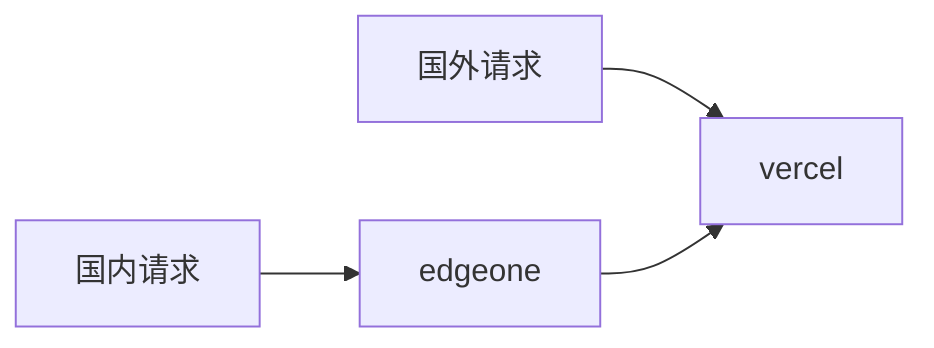
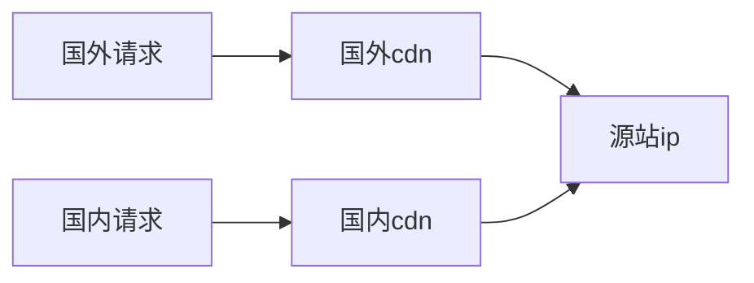

以 vercel 和 edgeone 和 dnspod 国际版为例

例子域名 `blog.com`

## 实现方式

1. vercel

   添加域名`blog.com`

2. edgeone

   添加域名`blog.com`

   源站地址:vercel 提供的`blog.com`的 CNAME 地址

3. dnspod 国际版

   添加域名`blog.com`

   将`blog.com`的 ns 解析改为 dnspod 提供 NS 地址

   添加国外解析记录

   - 主机记录：`@`
   - 线路类型:`默认`
   - 记录类型/值：vercel 提供的`blog.com`的 CNAME 地址

   添加国内解析记录

   - 主机记录：`@`
   - 线路类型:`中国`
   - 记录类型/值：edgeone 提供的`blog.com`的 CNAME 地址

## 原理

## 拓展

如果源站 ip 使用 cf 的小黄云，主机限制 cf 的 ip 段 访问，可以减少源站 ip 的泄漏和减缓攻击的影响

在 cdn 处利用优选 ip，可以进一步提升速度

获取优选 ip：[https://www.wetest.vip/](https://www.wetest.vip/)
