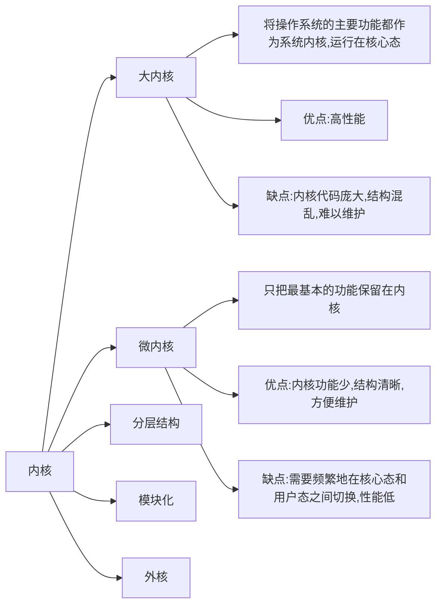

```mermaid
graph LR;
A[内核]
A --> B[大内核]
A --> C[微内核]
B --> 将操作系统的主要功能都作为系统内核,运行在核心态
B --> 优点:高性能
B --> 缺点:内核代码庞大,结构混乱,难以维护
C --> 只把最基本的功能保留在内核
C --> 优点:内核功能少,结构清晰,方便维护
C --> 缺点:需要频繁地在核心态和用户态之间切换,性能低
A --> 分层结构
A --> 模块化
A --> 外核
```
