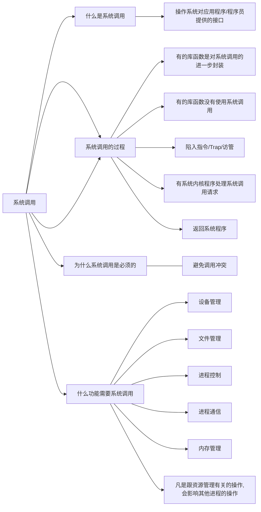

```mermaid
graph LR;
A[系统调用]
A --> 什么是系统调用 --> 操作系统对应用程序/程序员提供的接口
A --> B[系统调用和库函数的区别]
B --> 有的库函数是对系统调用的进一步封装
B --> 有的库函数没有使用系统调用
A --> 为什么系统调用是必须的 --- 避免调用冲突
A --> C[什么功能需要系统调用]
C --> 设备管理
C --> 文件管理
C --> 进程控制
C --> 进程通信
C --> 内存管理
C --> 凡是跟资源管理有关的操作,会影响其他进程的操作
A --> B[系统调用的过程]
B --> 陷入指令/Trap/访管
B --> 有系统内核程序处理系统调用请求
B --> 返回系统程序

```
