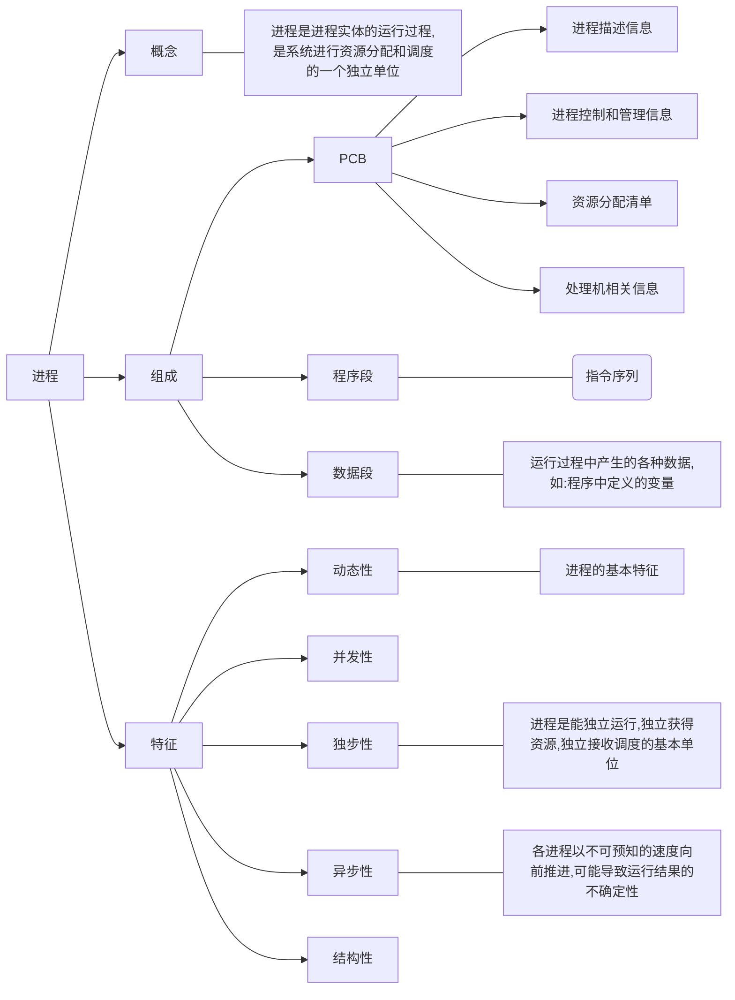
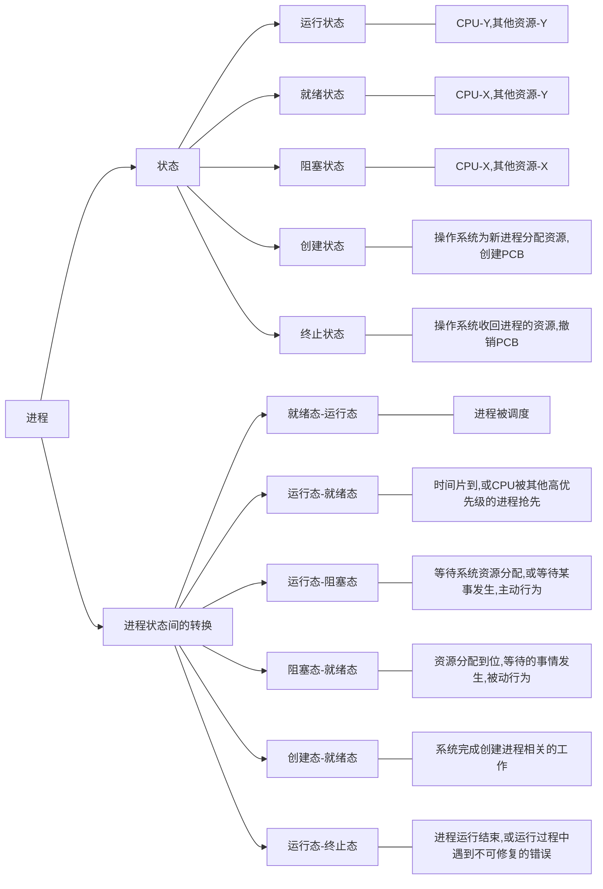
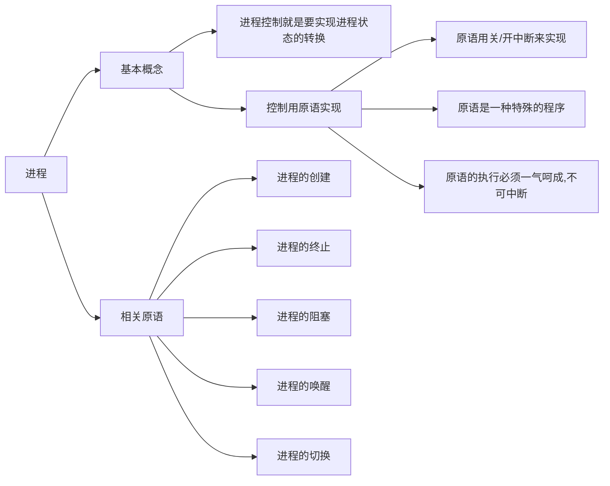
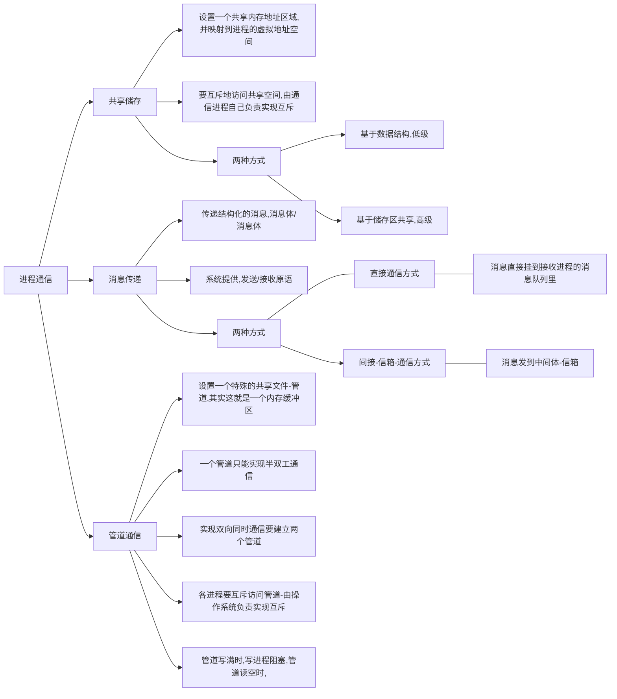

## 概念,组成,特征

```mermaid
graph LR;
A[进程]
A --> 概念 --- 进程是进程实体的运行过程,是系统进行资源分配和调度的一个独立单位
A --> B[组成]--> C[PCB]
C --> 进程描述信息
C --> 进程控制和管理信息
C --> 资源分配清单
C --> 处理机相关信息
B --> 程序段 --- 程序的代码(指令序列)
B --> 数据段 --- 运行过程中产生的各种数据,如:程序中定义的变量
A --> D[特征]
D --> 动态性 --- 进程的基本特征
D --> 并发性
D --> 独步性 --- 进程是能独立运行,独立获得资源,独立接收调度的基本单位
D --> 异步性 --- 各进程以不可预知的速度向前推进,可能导致运行结果的不确定性
D --> 结构性
```

## 状态与转换,组织

```mermaid
graph LR;
A[进程] --> B[状态]
A --> C[进程状态间的转换]
B --> 运行状态 --- CPU-Y,其他资源-Y
B --> 就绪状态 --- CPU-X,其他资源-Y
B --> 阻塞状态 --- CPU-X,其他资源-X
B --> 创建状态 --- 操作系统为新进程分配资源,创建PCB
B --> 终止状态 --- 操作系统收回进程的资源,撤销PCB
C --> 就绪态-运行态 --- 进程被调度
C --> 运行态-就绪态 --- 时间片到,或CPU被其他高优先级的进程抢先
C --> 运行态-阻塞态 --- 等待系统资源分配,或等待某事发生,主动行为
C --> 阻塞态-就绪态 --- 资源分配到位,等待的事情发生,被动行为
C --> 创建态-就绪态 --- 系统完成创建进程相关的工作
C --> 运行态-终止态 --- 进程运行结束,或运行过程中遇到不可修复的错误
```

## 进程控制

```mermaid
graph LR;
A[进程] --> B[基本概念]
A --> C[相关原语]
B --> 进程控制就是要实现进程状态的转换
B --> D[控制用原语实现]
D --> 原语用关/开中断来实现
D --> 原语是一种特殊的程序
D --> 原语的执行必须一气呵成,不可中断

C --> 进程的创建
C --> 进程的终止
C --> 进程的阻塞
C --> 进程的唤醒
C --> 进程的切换
```

## 通信

```mermaid
graph LR;
A[进程通信] --> B[共享储存]
A --> C[消息传递]
A --> D[管道通信]
B --> 设置一个共享内存地址区域,并映射到进程的虚拟地址空间
B --> 要互斥地访问共享空间,由通信进程自己负责实现互斥
B --> E[两种方式] --> 基于数据结构,低级
E --> 基于储存区共享,高级
C --> 传递结构化的消息,消息体/消息体
C --> 系统提供,发送/接收原语
C --> F[两种方式] --- 直接通信方式 --- 消息直接挂到接收进程的消息队列里
F --> 间接-信箱-通信方式 --- 消息发到中间体-信箱
D --> 设置一个特殊的共享文件-管道,其实这就是一个内存缓冲区
D --> 一个管道只能实现半双工通信
D --> 实现双向同时通信要建立两个管道
D --> 各进程要互斥访问管道-由操作系统负责实现互斥
D --> 管道写满时,写进程阻塞,管道读空时,
```
