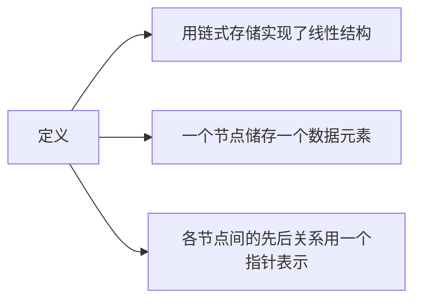

## 定义

```mermaid
graph LR;
    A[定义]
    A --> 用链式存储实现了线性结构
    A --> 一个节点储存一个数据元素
    A --> 各节点间的先后关系用一个指针表示

```

## 插入/删除

1. 按位依次查找,插入/删除
2. 后删,将后面的节点信息复制到本节点,然后删除后面一个节点
3. 前插,在后面新建一个节点,将本节点信息复制到新节点,将信息加入本节点

## 查找

1. 按值查找
2. 按位查找
3. 三种基本操作的时间复杂度都是O(n)
4. 注意边界条件
