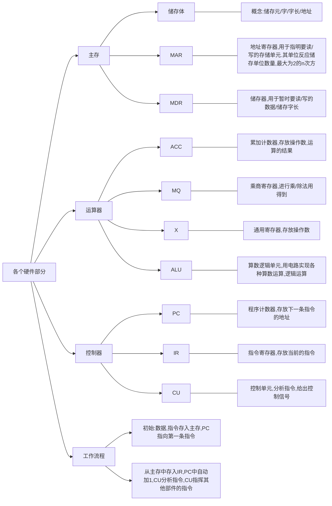

```mermaid
graph LR;
A[各个硬件部分]
A --> B[主存]
A --> C[运算器]
A --> D[控制器]
A --> E[工作流程]
B --> 储存体 --- 概念:储存元/字/字长/地址
B --> MAR --- 地址寄存器,用于指明要读/写的存储单元.其单位反应储存单位数量,最大为2的n次方
B --> MDR --- 储存器,用于暂时要读/写的数据/储存字长
C --> ACC --- 累加计数器,存放操作数,运算的结果
C --> MQ --- 乘商寄存器,进行乘/除法用得到
C --> X --- 通用寄存器,存放操作数
C --> ALU --- 算数逻辑单元,用电路实现各种算数运算,逻辑运算
D --> PC --- 程序计数器,存放下一条指令的地址
D --> IR --- 指令寄存器,存放当前的指令
D --> CU --- 控制单元,分析指令,给出控制信号
E --> 初始:数据,指令存入主存,PC指向第一条指令
E --> 从主存中存入IR,PC中自动加1,CU分析指令,CU指挥其他部件的指令

```
