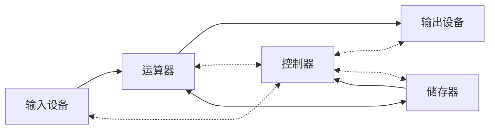
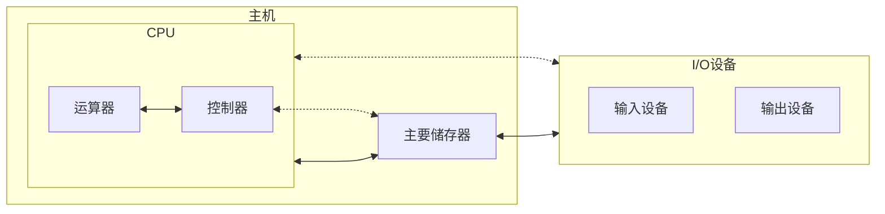
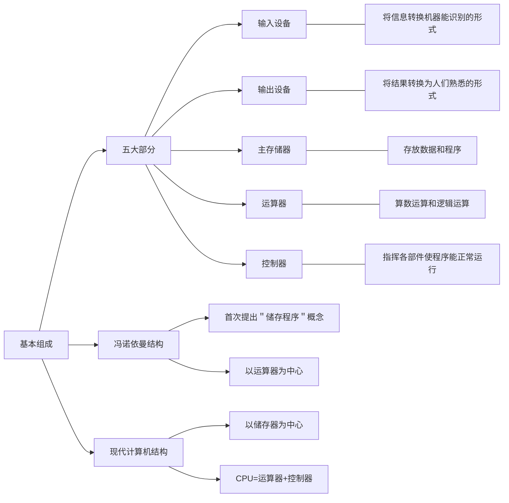

## 冯诺依曼计算机

实线 数据线

虚线 控制线\反馈线

```mermaid
graph LR;
A[输入设备]
    B[运算器]
    C[输出设备]
    D[储存器]
    E[控制器]
    A --> B --> C
    A <-..-> E 
    B <-..-> E 
B <--> D
    E <-..-> C
    E <-..-> D
    D --> E
```

## 现代计算机

```mermaid
graph LR;
        subgraph "I/O设备"
        A[输入设备]
            B[输出设备]
end
        subgraph "主机"
        subgraph "CPU"
                    C[运算器]
                    D[控制器]
C <--> D
        end
CPU  <--> E[主要储存器]
D <-..-> E
end
CPU <-..-> I/O设备
E <--> I/O设备
```

```mermaid
graph LR;
root[基本组成]
root --> A[五大部分]
root --> B[冯诺依曼结构]
root --> C[现代计算机结构]
A --> A1[输入设备] --- A11[将信息转换机器能识别的形式]
A --> A2[输出设备] --- A21[将结果转换为人们熟悉的形式]
A --> A3[主存储器] --- A31[存放数据和程序]
A --> A4[运算器] --- A41[算数运算和逻辑运算]
A --> A5[控制器] --- A51[指挥各部件使程序能正常运行]

B --> B1[首次提出＂储存程序＂概念]
B --> B2[以运算器为中心]

C --> C1[以储存器为中心]
C --> C2[CPU=运算器+控制器]
```
