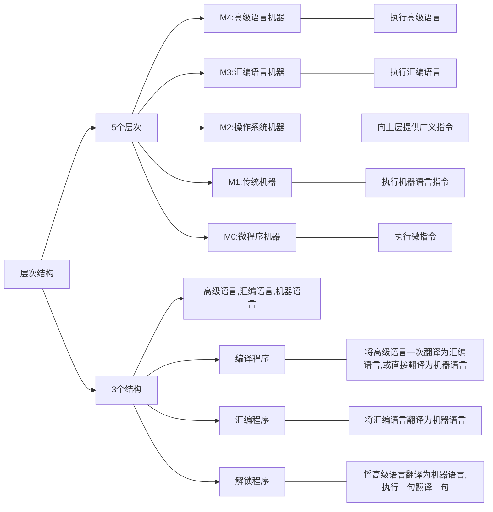

```mermaid
graph LR;
A[层次结构]
A --> B[5个层次]
A --> C[3个结构]

B --> M4:高级语言机器 --- 执行高级语言
B --> M3:汇编语言机器 --- 执行汇编语言
B --> M2:操作系统机器 --- 向上层提供广义指令
B --> M1:传统机器 --- 执行机器语言指令
B --> M0:微程序机器 --- 执行微指令

C --> 高级语言,汇编语言,机器语言
C --> 编译程序 --- 将高级语言一次翻译为汇编语言,或直接翻译为机器语言
C --> 汇编程序 --- 将汇编语言翻译为机器语言
C --> 解锁程序 --- 将高级语言翻译为机器语言,执行一句翻译一句
```
