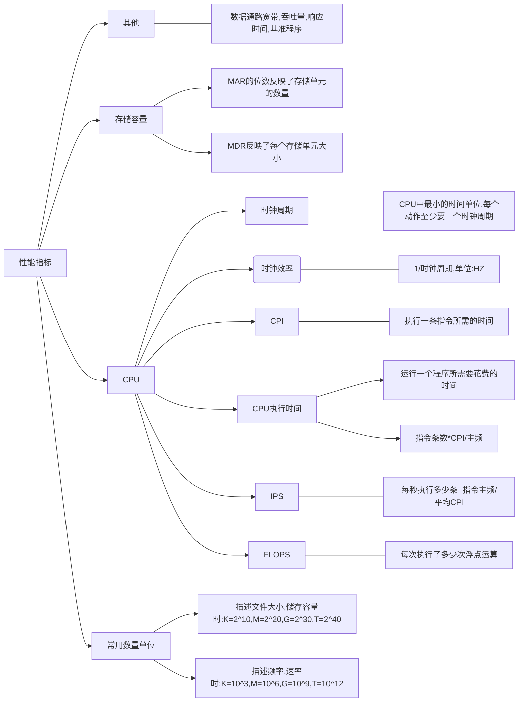

```mermaid
graph LR;
A[性能指标]
A --> B[存储容量]
A --> C[CPU]
A --> 其他 ---数据通路宽带,吞吐量,响应时间,基准程序
A --> D[常用数量单位]
B --> MAR的位数反映了存储单元的数量
B --> MDR反映了每个存储单元大小
C --> 时钟周期 --- CPU中最小的时间单位,每个动作至少要一个时钟周期
C --> 主频(时钟效率) --- 1/时钟周期,单位:HZ
C --> CPI --- 执行一条指令所需的时间
C --> E[CPU执行时间] --> 运行一个程序所需要花费的时间
E --> 指令条数*CPI/主频
C --> IPS --- Z["每秒执行多少条=指令主频/平均CPI"]

C --> FLOPS --- 每次执行了多少次浮点运算

D --> X["描述文件大小,储存容量时:K=2^10,M=2^20,G=2^30,T=2^40"]

D --> H["描述频率,速率时:K=10^3,M=10^6,G=10^9,T=10^12"]
```
