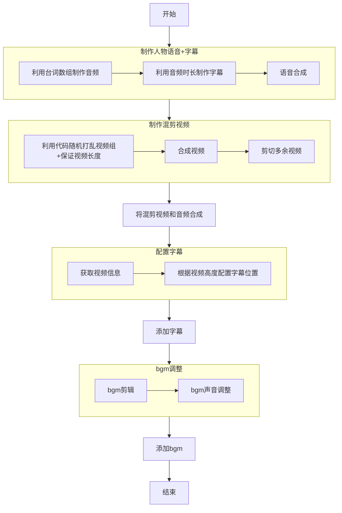
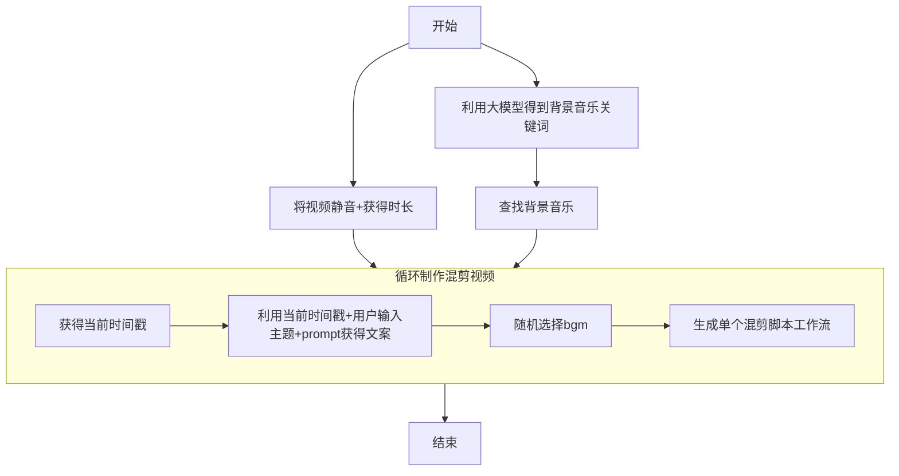

> 本教程以[扣子](https://www.coze.cn/home)为例

## 单个混剪

### 开始接收的变量 a

- bgm_url：背景音乐链接
- Copywriting_list：混剪视频链接数组
- video_duration_list：混剪视频信息数组
- video_list：台词数组

### 流程图 a



### 插件 a

- 语音合成：[https://www.coze.cn/store/plugin/7426654728890777650](https://www.coze.cn/store/plugin/7426654728890777650)
- 视频剪辑工具：[https://www.coze.cn/store/plugin/7514607196831940643](https://www.coze.cn/store/plugin/7514607196831940643)
- 视频信息获取：[https://www.coze.cn/store/plugin/7540140839356563471](https://www.coze.cn/store/plugin/7540140839356563471)

### 代码

#### 字幕构建

变量

- speech_info_list:视频信息列表 {text:台词;duration:时长}

```javascript
async function main({ params }: Args): Promise<Output> {
  // 确保 speech_info_list 存在且是一个数组，否则返回空列表以避免错误。
  if (!params.speech_info_list || !Array.isArray(params.speech_info_list)) {
    return { text_list: [] };
  }

  const text_list = [];
  let cumulative_time = 0; // 初始化累积时间，第一个片段的 start_time 将是 0。

  // 遍历输入的 speech_info_list 数组
  for (const item of params.speech_info_list) {
    const start_time = cumulative_time;

    // 将字符串格式的 duration 转换为浮点数进行计算
    const duration = parseFloat(item.duration);

    const end_time = start_time + duration;

    // 构建符合目标格式的新对象并添加到结果数组中
    text_list.push({
      start_time: start_time,
      text: item.text,
      end_time: end_time,
    });

    // 更新累积时间，为下一个片段的开始时间做准备，并加上 0.1 秒的间隔。
    cumulative_time = end_time + 0.1;
  }

  // 返回最终构建的、包含 text_list 的对象
  return { text_list };
}
```

#### 混剪视频打乱

变量

- video_time_list:视频时间列表
- original_video_list：视频列表
- speech_time：音频总时长

```javascript
interface Args {
  params: {
    original_video_list: string[], // 视频链接列表
    video_time_list: number[], // 视频时长列表 (单位：秒)
    speech_time: number, // 音频总时长 (单位：秒)
  };
}

// 将视频链接和时长组合在一起，方便处理
interface VideoInfo {
  url: string;
  duration: number;
}

async function main({ params }: Args): Promise<Output> {
  const { original_video_list, video_time_list, speech_time } = params;

  // --- 1. 输入验证 (Edge Case Handling) ---
  // 如果视频列表为空，直接返回空结果，避免无限循环
  if (!original_video_list || original_video_list.length === 0) {
    console.error("错误：输入的视频列表为空。");
    return { video_list: [] };
  }
  // 确保视频列表和时长列表长度一致
  if (original_video_list.length !== video_time_list.length) {
    throw new Error("视频列表和时长列表的长度不匹配。");
  }

  // --- 2. 数据准备 ---
  // 将视频链接和时长合并成一个对象数组，方便后续操作
  const allVideos: VideoInfo[] = original_video_list.map((url, index) => ({
    url: url,
    duration: video_time_list[index],
  }));

  // --- 3. 核心抽取逻辑 ---
  let selectedVideoUrls: string[] = [];
  let currentTotalDuration = 0;

  // 创建一个可变的视频池，用于“抽一个少一个”的操作
  let availableVideos = [...allVideos];

  // 循环条件：当累积时长小于或等于目标音频时长时，继续抽取
  while (currentTotalDuration <= speech_time) {
    // 如果可抽取的视频池空了（所有视频都抽过一轮了）
    if (availableVideos.length === 0) {
      // 重置视频池，开始新一轮抽取
      availableVideos = [...allVideos];
    }

    // 从当前视频池中随机选择一个视频
    const randomIndex = Math.floor(Math.random() * availableVideos.length);

    // 这就实现了“抽一个少一个”的效果。
    const [chosenVideo] = availableVideos.splice(randomIndex, 1);

    // 更新结果
    selectedVideoUrls.push(chosenVideo.url);
    currentTotalDuration += chosenVideo.duration;
  }

  // --- 4. 返回结果 ---
  return {
    video_list: selectedVideoUrls,
  };
}
```

## 多个混剪

### 开始接收的变量 b

- title:视频核心内容
- videos:视频列表
- round:循环次数

### 流程图 b



### 大模型 prompt

#### bgm

```markdown
# 任务

你是一个 BGM 关键词生成器。根据主题 `{{title}}`，生成一组最适合在抖音、剪映中搜索的 BGM 关键词。

# 要求

- 直接输出结果，不要任何解释。
- 关键词之间用空格隔开。
- 只输出一组最佳组合。
```

#### 文案

```markdown
# 角色

你是一位顶级的短视频脚本专家，同时也是一个专业的 AI 字幕切分引擎。

# 核心任务

你的任务是根据我提供的视频主题 `{{title}}`，并结合下面的随机种子，在内部构思一篇完整的口语化视频口播稿，然后**直接输出**经过快节奏、超短句切分处理后的最终字幕文案。

**本次创作的随机种子是：`{{random_seed}}`。请将此种子作为你创意的来源，确保内容独一无二。**

# 工作流程与规则

1.  **构思脚本 (内部环节)**：根据 `{{title}}` 和随机种子，在你的“脑中”创作一段完整、流畅、吸引人的口播稿。**不要输出这一步的完整稿件**。
2.  **切分并输出 (最终交付)**：将你构思好的脚本，严格遵循以下规则进行处理，并作为最终结果输出：
    - **字数限制**: 每行严格在 **8 个字以内**。
    - **移除标点**: 必须 **移除所有标点符号**。
    - **忠于原文**: 输出的文字必须完全来自于你构思的脚本，**不可修改、增删任何文字**。
    - **格式**: 每行一句，直接输出纯文本。
```

### 插件 b

- 背景音乐库：[https://www.coze.cn/store/plugin/7477778095559213092](https://www.coze.cn/store/plugin/7477778095559213092)
